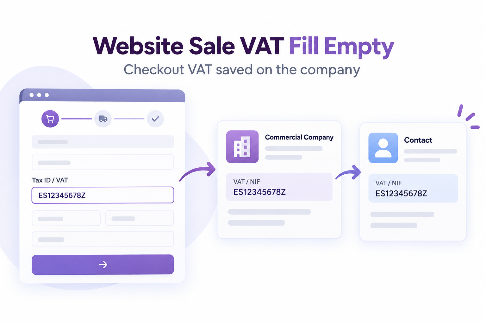

# Website Sale VAT Fill Empty

Permite que un cliente de la tienda informe su NIF/VAT durante el checkout
cuando su contacto comercial todavía no tiene uno. El valor se guarda en la
empresa principal y Odoo lo propaga de forma nativa a sus contactos y
direcciones.

## Funcionalidad

- Muestra el campo VAT/NIF cuando el contacto comercial está vacío.
- Permite completarlo desde las direcciones de facturación y entrega.
- Guarda el valor en `commercial_partner_id`, nunca únicamente en el contacto hijo.
- Conserva formato por país, VIES y `website_sale_vat_required`.
- Mantiene el bloqueo nativo: un VAT existente nunca se sustituye desde checkout.
- No modifica los formularios del backend ni del portal.

## Instalación

1. Copiar `website_sale_vat_fill_empty` a una ruta de addons.
2. Actualizar la lista de aplicaciones.
3. Instalar **Website Sale VAT Fill Empty**.

## Pruebas manuales

1. Crear o usar un contacto hijo cuya empresa no tenga VAT.
2. Añadir un producto al carrito y abrir el checkout.
3. Introducir un VAT válido para el país seleccionado y guardar la dirección.
4. Abrir la empresa principal y confirmar que el VAT está en ella y se muestra heredado en el contacto.
5. Repetir con una empresa que ya tenga VAT y confirmar que el campo permanece bloqueado.

## Technical notes

The module extends only the website checkout controller and `res.partner`.
The checkout exception is isolated in a context key, while the actual write is
performed on `commercial_partner_id` so Odoo's native commercial-field
synchronisation remains the source of truth.

## Requirements

- Odoo 18.0
- `website_sale`
- `account`
- License: LGPL-3

**Author:** [Ganemo](https://www.ganemo.co)
